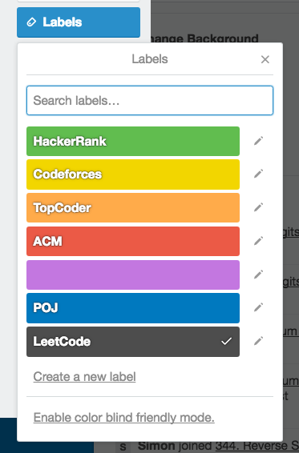

# Show My Solutions
Update submissions from OJs onto Trello.

Suppose you have solved some problems on LeetCode:


You may want to share them with your friends, or just to keep track of your solutions from various online judges in one place. With the following configuration, you can bring all the accepted submissions from LeetCode onto Trello in the form of cards:

```js
{
    "sources": ["leetcode"],
    "leetcode": {
        "username": "my username",
        "password": "my password"
    },
    
    "handlers": ["trello"],
    "trello": {
        "target_board_name": "Example Board",
        "target_list_name": "Example List"
    }
}
```

After you finish login in the popup window, the _Example List_ in the _Example Board_ is updated:


And here is details of a card:


Corresponding labels will be attached only if they are already created:




## Install

```
pip install -r requirements.txt
```


### Requirements

- Python 3
- Flask
- parsedatetime
- pytz
- requests
- beautifulsoup4


## Usage

Change directory, build a config.json here or specify a config file with `--config path`, and run:

```
./run.py
```


### Configuration

```js
{
    // (optional) Logging level
    "logging": "DEBUG",
    
    // (optional) Sources to get submissions
    "sources": ["leetcode"],

    // (optional) Source-specific options
    "leetcode": {
        // (required) Username or e-mail of your LeetCode account
        "username": "my username",

        // (required)
        "password": "my password"
    },


    // (optional) Handlers to handle submissions
    "handlers": ["trello"],

    // (optional) Handler-specific options
    "trello": {
        // (required) Name of the board where cards are created
        "target_board_name": "Example Board",
        
        // (required) Name of the list where cards are created
        "target_list_name": "Example List",

        // (optional) Manually copy the user token here if auto-authentication fails
        "user_token": null,

        // (optional) Expiration of the user token
        "auth_expiration": "30days"
    },

    // (optinal) datetime.strftime() format of submit time for displaying
    // May not be followed when precise time is unavailable
    "submit_time_format": "%b %d %H:%M %Z"
}
```

Note: A database is used to keep track of the uploaded submissions. Therefore, you can run this script multiple times without duplicating cards on Trello. Also, submissions already uploaded will not be uploaded again as long as the database exsits. To reset the database, simply run `./run.py -r`.
